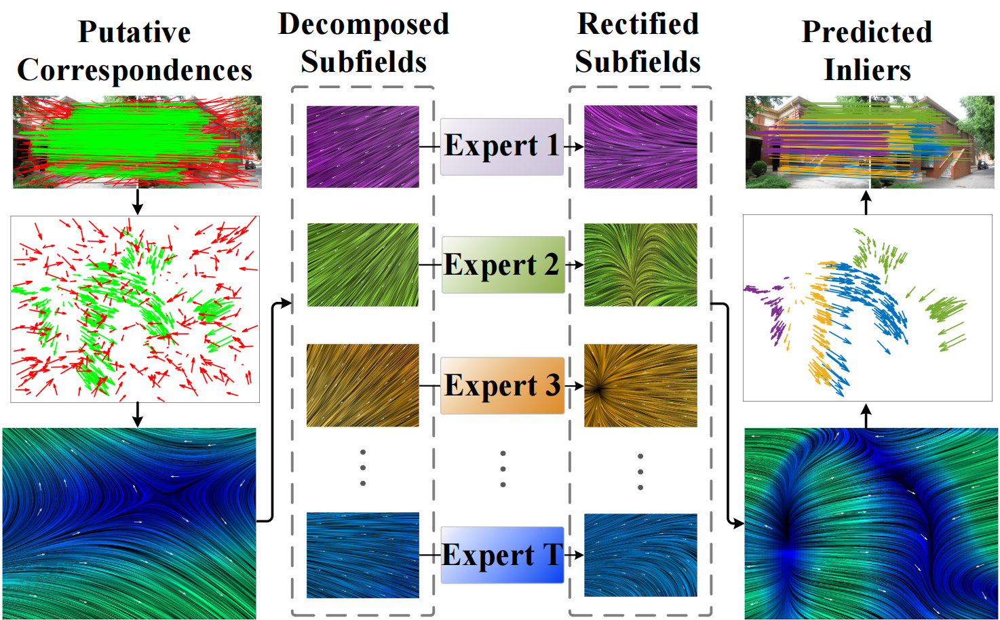

<p align="center">
  <h1 align="center">GeoMoE: Divide-and-Conquer Motion Field Modeling with Mixture-of-Experts for Two-View Geometry</h1>
</p>

<p align="center">
  <a href="https://scholar.google.com/citations?user=uWhzrG4AAAAJ&hl=zh-CN&oi=sra">Jiajun Le<sup></sup> ·
  <a href="https://scholar.google.com/citations?user=73trMQkAAAAJ&hl">Jiayi Ma</a><sup>*</sup> ·
</p>

<p align="center">
  <sup></sup>Wuhan University&nbsp;&nbsp;&nbsp;&nbsp;
  <sup>*</sup>Corresponding author
</p>

<p align="center">
  <a href="https://arxiv.org/abs/2508.00592">
    
  </a>
</p>

GeoMoE models two-view matching as motion-field consensus and explicitly decomposes the global motion field into multiple sub-fields, each handled by a specialized Mixture-of-Experts module guided by inlier-prior cues. This decoupling reduces interference across motion regimes, yielding more reliable inlier prediction.
<p align="center">
  
</p>
---

If you find this project useful, please cite:

```
@inproceedings{Le2026GeoMoE,
  title={GeoMoE: Divide-and-Conquer Motion Field Modeling with Mixture-of-Experts for Two-View Geometry},
  author={Le, Jiajun and Ma, Jiayi},
  booktitle={Proceedings of the AAAI Conference on Artificial Intelligence},
  year={2026}
}
```

## Requirements and Compilation

Please use Python 3.8.5, opencv-contrib-python (4.12.0.88) and Pytorch (>= 1.9.1). Other dependencies should be easily installed through pip or conda.


## Example scripts

### Run the demo

You can run the feature matching for two images with GeoMoE.

```bash
cd demo && python demo.py
```

### Datasets and Pretrained models

Download the pretrained models from [here](https://drive.google.com/drive/folders/1p6_Mz2ovmAhA1gvP4Pork7vugRn3nK55).

Download YFCC100M dataset.
```bash
bash download_data.sh raw_data raw_data_yfcc.tar.gz 0 8
tar -xvf raw_data_yfcc.tar.gz
```

Download SUN3D testing (1.1G) and training (31G) dataset if you need.
```bash
bash download_data.sh raw_sun3d_test raw_sun3d_test.tar.gz 0 2
tar -xvf raw_sun3d_test.tar.gz
bash download_data.sh raw_sun3d_train raw_sun3d_train.tar.gz 0 63
tar -xvf raw_sun3d_train.tar.gz
```

### Test pretrained model

We provide the models trained on the YFCC100M and SUN3D datasets, as detailed in our AAAI paper. By running the test script, you can obtain results similar to those presented in our paper. Note that the generated putative matches may differ if the data is regenerated.

```bash
cd ../test 
python test.py
```
To adjust the default settings for test, you can edit the `../test/config.py`.

### Train model on YFCC100M or SUN3D

After generating dataset for YFCC100M, run the tranining script.
```bash
cd ../core 
python main.py
```
